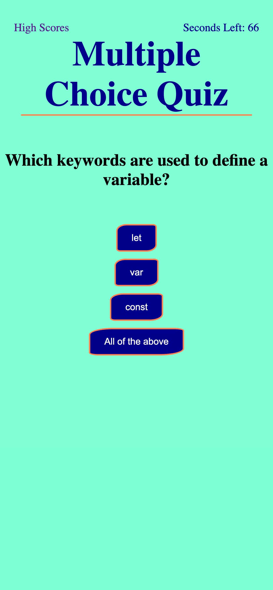

# Multiple Choice Quiz

## Description

As a boot camp student, I want to take a timed quiz on JavaScript that stores my high scores to gauge my progress.  Each question is worth one point.  If you answer correctly, move on to the next question.  If you answer wrong, you loose 15 seconds off the time.  

## Usage

Click the "Let's Go!" button to begin the quiz.  View high scores from the high scores link on the home page.  

https://marbfree.github.io/Multiple-Choice-Quiz/
   

##Acknowledgements
Thank you to my tutor, Benicio Lopez, for helping me display the high scores.  Lines 27 - 38.

Thank you to the askBCS Learning Assistants for keeping me on track and assisting me when I got stuck.
