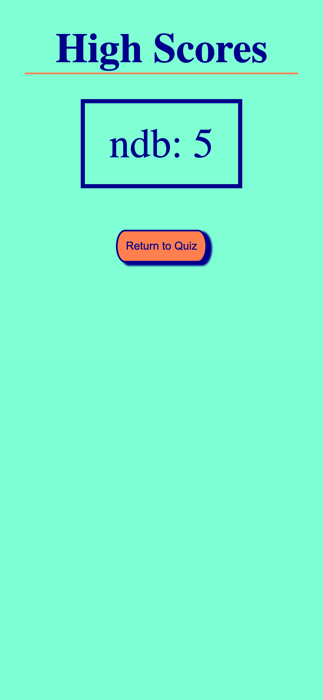

# Multiple Choice Quiz

## Description

As a boot camp student, I wanted to take a times quiz on JavaScript that stores my high scores to gauge my progress.

## Usage

Click the "Let's Go!" button to begin the quiz.  View high scores from the high scores link on the home page.  

   
    
    
    
    

#Acknowledgements
Thank you, Benicio Lopez, for helping me display my high scores.  Lines 27 - 38.

Thank you Chart JS for your tutorial on how to create a button with a link in Javascript.  I was helped with line 17 in HTML and the function on line 9 in JavaScript. See link below for the video tutorial. 

https://www.google.com/search?q=how+to+add+a+link+to+a+function+in+javascript&oq=how+to+add+a+link+to+a+function&aqs=chrome.0.69i59j69i57.6153j0j4&sourceid=chrome&ie=UTF-8#fpstate=ive&vld=cid:8f4adf75,vid:xVMkFJZhZYU